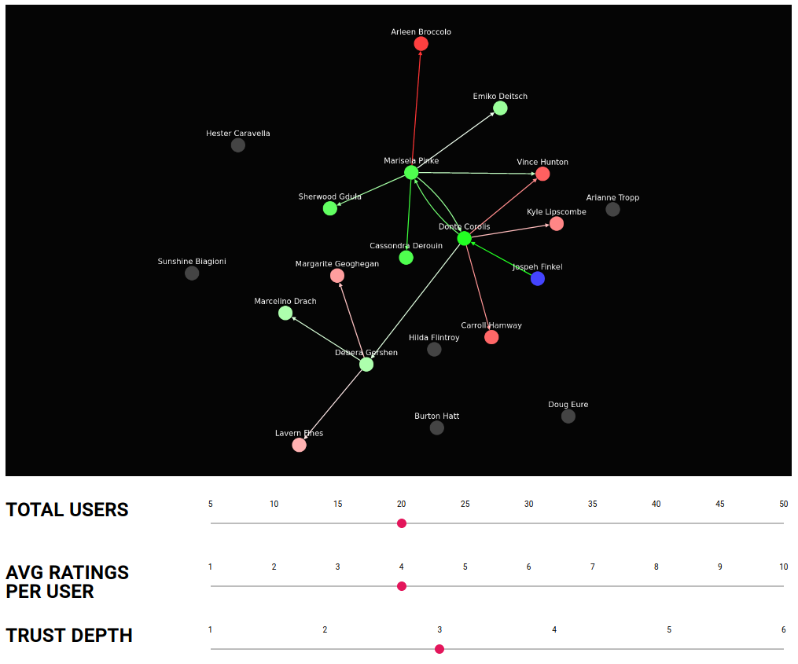

# Decentralized Trust Demo

This is a demo of the Decentralized Trust system [described on A Decentralized World](https://adecentralizedworld.com).

## Overview

The demo initially shows a graph of all users and trust ratings between
them. These trust ratings are randomly set. Upon selecting a user you'll
see their world of trust from their perspective. The amount each user trusts
another user is shown by the arrow between them. Each users color represents
how much they are trusted by the selected user, calculated via the algorithm
described in the blog post.

You can use the sliders to choose how many users are in the simulation, how many users each user trusts on average, and how deep the trust calculations are done.

## Usage

`npm start` - Start the trust demo. This will launch it in your browser.

`npm test` - Run the test suite.

## Algorithm

The algorithm and vision behind this trust system is [described in this blog post](https://adecentralizedworld.com).

The general rules are:

- Users can trust any other user of a rating between -100 and 100.
- When a rating is set it is fixed and is not influenced by anyone else.
- Friends of friends are given a rating via the formula `MIN(UserToFriendRating, SQRT(UserToFriendRating * FriendToStrangerRating))`.
- When a negative rating is encountered, no further trust is given to anyone that person knows (so malicious users can't game the system).

## Implementation

This algorithms is implemented in [src/models.js](src/models.js), feel free to use this to implement a trust system in your own social network.
I plan on turning this into a [Scuttlebutt] plugin, and implementing it in most major [Scuttlebutt] clients.

[Scuttlebutt]: https://scuttlebutt.nz

## License

MIT